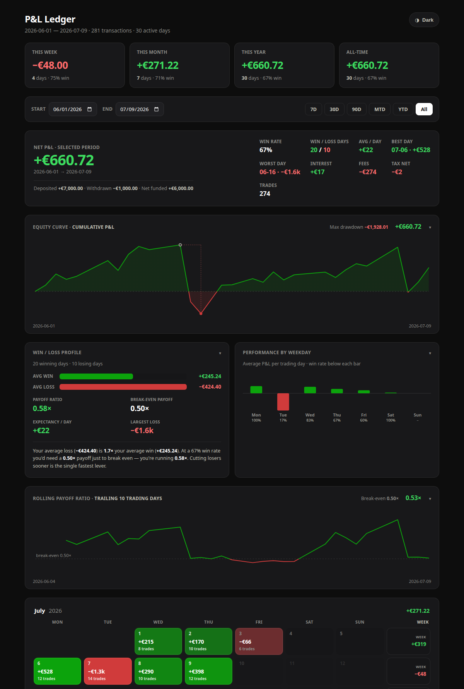

# P&L Ledger

A calendar-style trading journal that turns a broker's transaction export into a
dashboard you can actually read at a glance — daily P&L on a colour-graded
calendar, an equity curve, and a few analytics built around one question:
*am I getting better?*

It started as a personal tool for reviewing my own trading (the export format is
[Trade Republic](https://traderepublic.com)'s), but the P&L logic is general and
the whole thing is dependency-free.



## Motivation

I trade actively, and my broker's app is great for placing orders but useless for
reflection — it shows you a balance, not a story. What I actually wanted was to
*see* my P&L: which days I made money, which days I handed it back, and whether
the mistakes I keep promising myself I'll fix are actually getting fixed.
Scrolling a list of transactions doesn't tell you that; a calendar you can take
in at a glance does.

So I built the tool I wished I had — something that lets me look at a month and
immediately spot the pattern, then dig into the numbers behind it: how big my
losers are next to my winners, which days of the week I trade well or badly, and
whether my edge is trending the right way. It ended up being as much a coaching
tool as a dashboard. The point was never perfect accounting — it was to make my
own trading habits impossible to ignore.

## What it does

- **Daily P&L calendar** — every trading day coloured green/red by size, with the
  amount and trade count in the cell and a full breakdown on hover. Months stack
  newest-first, with a weekly total in the right margin.
- **Realized P&L, done properly** — sells are matched against a running average
  cost per instrument, so profit lands on the day you *closed*, not the day you
  opened. Dividends and interest count as income; fees and capital-gains tax are
  applied on their day; deposits and withdrawals are kept out of P&L.
- **Equity curve** with the max drawdown marked.
- **Win/loss profile** — average win vs. average loss, payoff ratio, and the
  payoff you'd need to break even at your win rate. (Turns out a good win rate
  doesn't save you if your losers are twice your winners.)
- **Rolling payoff ratio** — a trailing-window view so you can watch whether the
  thing you're working on is actually trending the right way.
- **Performance by weekday**, live stat cards (this week / month / year /
  all-time), date-range filtering with presets, deposit/withdrawal totals, a
  light/dark toggle, and collapsible panels — state remembered between visits.

The output is a **single self-contained `dashboard.html`** — no server, no build
step at view time, no external requests. Open it in any browser.

## Quick start

```sh
uv run python build.py      # reads data/*.csv -> dashboard.html
```

Then open `dashboard.html`. Out of the box it renders the bundled sample data
(`data/demo.csv`), so you can see the whole thing working before pointing it at
anything real.

> Uses [uv](https://docs.astral.sh/uv/). No `uv`? Any Python 3.9+ works:
> `python build.py`. There are no third-party runtime dependencies.

## Using your own data

### Exporting from Trade Republic

Trade Republic can hand you a CSV that's meant for exactly this kind of tool. In
the app, open **Profile → Statements & transaction export**, choose the
transaction export, and pick the **"CSV export for tracking tools"** option
(not the PDF statement or the tax-tool export — those don't carry the right
columns). Choose your date range and export. That file is what this project
reads.

### Loading it

Drop one or more of those CSVs into `data/` and rebuild. Multiple files are
merged and de-duplicated by `transaction_id`, so you can keep dropping in fresh
exports over time without worrying about overlap. As soon as a real export is
present, the bundled `demo.csv` steps aside automatically.

```sh
cp ~/Downloads/transactions.csv data/
uv run python build.py
```

The columns that matter are `date`, `type`, `symbol`, `shares`, `amount`, `fee`,
`tax`, and `transaction_id`. `type` drives everything —
`BUY` / `SELL` / `DIVIDEND` / `INTEREST_PAYMENT` / `TAX_OPTIMIZATION` /
`TRANSFER_INSTANT_INBOUND` / `TRANSFER_INSTANT_OUTBOUND`.

Your real data stays local — `.gitignore` keeps every CSV except `demo.csv` out
of the repo.

## How the P&L is calculated

The interesting logic lives in [`analysis.py`](analysis.py). A few decisions
worth calling out:

- **Average-cost matching.** Each instrument tracks running quantity and cost.
  A sell realizes `proceeds − avg_cost × qty_sold`. This handles positions held
  across days and partial exits without needing lot-level bookkeeping.
- **Tax is a signed cash impact.** On a profitable sell, tax is *withheld*
  (negative). When the broker later refunds it via loss-offsetting
  (`TAX_OPTIMIZATION`, positive), that's added back on the day it lands. Over a
  losing period the two roughly cancel — which is easy to get wrong if you only
  read the tax on dividend rows, so there's a test pinning exactly this.
- **Transfers aren't P&L.** Deposits and withdrawals move your own money; they're
  tracked separately as funding, never as profit, and a pure-transfer day never
  shows up as a calendar cell.

## Project structure

The work is split so each piece has one job and can be read (and tested) on its
own:

```
loader.py      data access — find, merge, de-dupe the CSVs
analysis.py    pure computation — rows -> per-day P&L + funding + meta
build.py       orchestrator — assemble web/ + data -> dashboard.html
web/
  template.html   HTML shell with placeholders
  styles.css      all styling
  app.js          all behaviour (vanilla JS, SVG charts)
data/demo.csv  bundled sample data
tests/         pytest suite for the analysis and loader
```

The build is a straight line: `load_transactions → build_payload → render`.
`render` inlines the stylesheet, script, and JSON data into the HTML shell so the
result is one portable file. `loader` and `analysis` are side-effect free, which
is what makes them easy to test:

```python
import loader, analysis
rows = loader.load_transactions("data")
payload = analysis.build_payload(rows)   # {"days": [...], "flows": [...], "meta": {...}}
```

## Development

```sh
uv run pytest        # tests for the P&L math + loader precedence/de-dup
uv run ruff check .  # lint
```

## Notes on the design

- **No framework, no runtime dependencies.** The back end is standard-library
  Python; the front end is vanilla JS with hand-rolled SVG charts. For a tool
  this size, a build toolchain and a charting library would be more moving parts
  than the problem needs — and it keeps the output genuinely portable.
- **Self-contained output on purpose.** A single HTML file with the data baked in
  is trivial to share, archive month-to-month, or open years later. The
  front-end sources stay split for editing; `build.py` is what stitches them
  together.
- **Colour is never the only signal.** Green/red is the one pairing that trips up
  colour-blind readers, so every day cell also carries its number and an exact
  breakdown on hover.

## License

[MIT](LICENSE)
